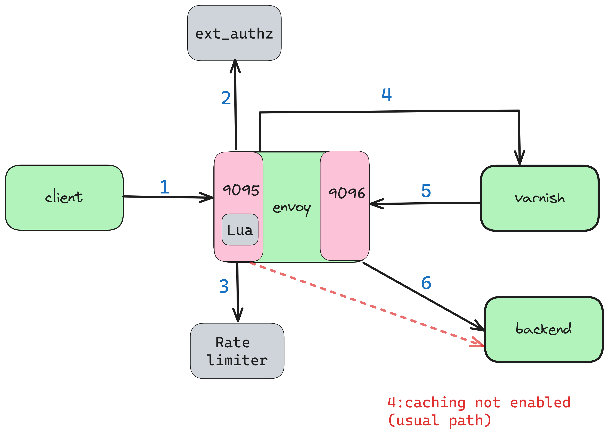

## Following architecture is tried out



### steps

1. Run docker-compose up

2. Test the following request for non cached path(rate limit: 2 per min)

```bash
http://localhost:9095/customurl/1
x-cluster-header:actual_backend_cluster
Authorization:Bearer valid_token_2
foo:foo
```
3. Test the following request for a cached path(rate limit: 2 per min)

```bash
http://localhost:9095/customurl/1
x-cluster-header:varnish_backend_cluster
redirect-backend:actual_backend_cluster
x-temp-path:/customurl/1
Authorization:Bearer valid_token_2
foo:foo
```